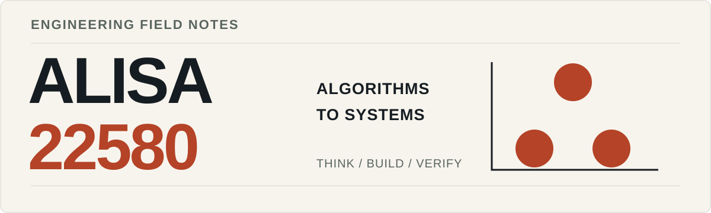

<picture>
  <source media="(prefers-color-scheme: dark) and (max-width: 600px)" srcset="./assets/hero-mobile-dark.svg" />
  <source media="(prefers-color-scheme: dark)" srcset="./assets/hero-dark.svg" />
  <source media="(max-width: 600px)" srcset="./assets/hero-mobile-light.svg" />
  
</picture>

<p align="right">
  <a href="https://alisa22580.com/">数字花园</a> &nbsp; / &nbsp;
  <a href="https://codeforces.com/profile/alisa22580">Codeforces</a> &nbsp; / &nbsp;
  <a href="https://github.com/2258009564?tab=repositories">GitHub 仓库</a>
</p>

# 从算法，走向系统。

我是 **alisa22580**，一名软件工程学生，关注存储与分布式基础设施。从 C++ 竞赛练习出发，逐步学习 Go 与 Raft，也为自己的阅读、编码和知识记录做工具。

比起只让代码运行，我更想弄清它依赖什么假设、在哪些边界失效，以及怎样验证。这份主页收录学习记录和公开项目，具体实现与阶段成果都能从下面的链接继续查看。

## 项目与实践

### [Raft Study ↗](https://github.com/2258009564/raft-study)

`系统学习` · `Go / MIT 6.5840` · `源码私有`

围绕 Raft 的任期、投票、选举与心跳，整理中文架构说明、消息时间线和测试记录。目前完成 **Lab 3A 选举阶段**；日志复制、持久化与快照仍是后续阶段，公开仓库保留学习文档与验收说明。

[架构与阶段说明](https://github.com/2258009564/raft-study/blob/main/README.md) &nbsp; · &nbsp; [测试记录](https://github.com/2258009564/raft-study/blob/main/docs/verification.md) &nbsp; · &nbsp; [来源与贡献说明](https://github.com/2258009564/raft-study/blob/main/docs/sources.md)

### [SelectEcho ↗](https://github.com/2258009564/SelectEcho)

`浏览器扩展` · `JavaScript / Manifest V3`

为 Chrome / Edge 做的划词翻译工具。关注翻译引擎的选择、段落与列表等结构的保留，以及复杂内容的降级展示，让日常阅读少一点打断。

[安装与使用](https://github.com/2258009564/SelectEcho/blob/main/README.md) &nbsp; · &nbsp; [内容处理实现](https://github.com/2258009564/SelectEcho/blob/main/content.js)

### [cph.nvim ↗](https://github.com/2258009564/cph_for_nvim)

`编辑器工具` · `Lua / Neovim`

把竞赛练习接入自己的编辑器：接收 Competitive Companion 题目，保存和管理测试用例，在 Neovim 内编译运行并比较输出。将题目接收、执行与结果展示拆成清晰的模块。

[中文使用说明](https://github.com/2258009564/cph_for_nvim/blob/master/README.zh.md) &nbsp; · &nbsp; [插件模块](https://github.com/2258009564/cph_for_nvim/tree/master/lua/cph)

## 练习与记录

**算法起点** &nbsp; [MYWORK](https://github.com/2258009564/MYWORK) 保存 C++ 练习、竞赛模板和编辑器配置，是一路积累的代码归档。

**知识记录** &nbsp; 在 [数字花园](https://alisa22580.com/) 留下教程、算法思路与个人笔记；在 [Codeforces](https://codeforces.com/profile/alisa22580) 保留解题足迹。

**编程与工具** &nbsp; C++ · Go · Python · JavaScript · Lua &nbsp; / &nbsp; Git · Neovim · VS Code · Windows / WSL

## 开发足迹

<details>
<summary><b>展开 WakaTime 编码统计</b></summary>

<!--START_SECTION:waka-->


**🐱 My GitHub Data** 

> 📦 409.9 kB Used in GitHub's Storage 
 > 
> 🏆 73 Contributions in the Year 2026
 > 
> 💼 Opted to Hire
 > 
> 📜 13 Public Repositories 
 > 
> 🔑 1 Private Repositories 
 > 
**I'm a Night 🦉** 

```text
🌞 Morning                17 commits          █░░░░░░░░░░░░░░░░░░░░░░░░   03.05 % 
🌆 Daytime                126 commits         ██████░░░░░░░░░░░░░░░░░░░   22.58 % 
🌃 Evening                343 commits         ███████████████░░░░░░░░░░   61.47 % 
🌙 Night                  72 commits          ███░░░░░░░░░░░░░░░░░░░░░░   12.90 % 
```
📅 **I'm Most Productive on Monday** 

```text
Monday                   217 commits         ██████████░░░░░░░░░░░░░░░   38.89 % 
Tuesday                  32 commits          █░░░░░░░░░░░░░░░░░░░░░░░░   05.73 % 
Wednesday                72 commits          ███░░░░░░░░░░░░░░░░░░░░░░   12.90 % 
Thursday                 34 commits          ██░░░░░░░░░░░░░░░░░░░░░░░   06.09 % 
Friday                   93 commits          ████░░░░░░░░░░░░░░░░░░░░░   16.67 % 
Saturday                 60 commits          ███░░░░░░░░░░░░░░░░░░░░░░   10.75 % 
Sunday                   50 commits          ██░░░░░░░░░░░░░░░░░░░░░░░   08.96 % 
```


📊 **This Week I Spent My Time On** 

```text
🕑︎ Time Zone: Asia/Shanghai

💬 Programming Languages: 
C++                      5 hrs 22 mins       ████████░░░░░░░░░░░░░░░░░   33.48 % 
Other                    4 hrs 9 mins        ██████░░░░░░░░░░░░░░░░░░░   25.88 % 
Markdown                 3 hrs 48 mins       ██████░░░░░░░░░░░░░░░░░░░   23.74 % 
HTML                     46 mins             █░░░░░░░░░░░░░░░░░░░░░░░░   04.84 % 
JSON                     28 mins             █░░░░░░░░░░░░░░░░░░░░░░░░   02.94 % 

🔥 Editors: 
Codex Vscode             8 hrs 22 mins       █████████████░░░░░░░░░░░░   52.22 % 
VS Code                  7 hrs 32 mins       ████████████░░░░░░░░░░░░░   46.94 % 
Obsidian                 7 mins              ░░░░░░░░░░░░░░░░░░░░░░░░░   00.77 % 
Codex CLI                0 secs              ░░░░░░░░░░░░░░░░░░░░░░░░░   00.07 % 

🐱‍💻 Projects: 
new-chat                 4 hrs 25 mins       ███████░░░░░░░░░░░░░░░░░░   27.54 % 
MIT-6.5840               3 hrs 41 mins       ██████░░░░░░░░░░░░░░░░░░░   22.96 % 
MYWORK                   3 hrs 19 mins       █████░░░░░░░░░░░░░░░░░░░░   20.69 % 
mizuki                   1 hr 4 mins         ██░░░░░░░░░░░░░░░░░░░░░░░   06.71 % 
https-www-bilibili-com-vi51 mins             █░░░░░░░░░░░░░░░░░░░░░░░░   05.32 % 

💻 Operating System: 
Windows                  16 hrs 3 mins       █████████████████████████   100.00 % 
```

🤖 **AI Coding This Week** 

```text
⏱ AI Coding Time: 9 hrs 9 mins (57.01%)

✍️ 1,406 lines written by AI, 1,616 lines written by hand (46.53% AI-written)

🔤 6,773,965 Input Tokens, 385,169 Output Tokens

💵 $44.08 Estimated AI Cost This Week

🧠 34 AI Sessions, 166 AI Prompts

GPT                      1,435 lines         █████████████████████████   100.00 % 
Codex-Vscode             0 lines             ░░░░░░░░░░░░░░░░░░░░░░░░░   00.00 % 

🔎 AI Coding Insights:
⚖️ Balanced with AI — 46.53% of written lines came from AI
📚 Verbose Prompter — average 3,203 characters per prompt
🔁 Iterative Prompter — average 5 prompts per session
🔍 Hands-On Reviewer — 62.53% of changed lines were hand-edited
```

**I Mostly Code in JavaScript** 

```text
JavaScript               3 repos             ███████░░░░░░░░░░░░░░░░░░   27.27 % 
C++                      2 repos             █████░░░░░░░░░░░░░░░░░░░░   18.18 % 
Lua                      1 repo              ██░░░░░░░░░░░░░░░░░░░░░░░   09.09 % 
Vue                      1 repo              ██░░░░░░░░░░░░░░░░░░░░░░░   09.09 % 
CSS                      1 repo              ██░░░░░░░░░░░░░░░░░░░░░░░   09.09 % 
```


**Timeline**


 Last Updated on 02/10/2026 22:24:30 UTC
<!--END_SECTION:waka-->

</details>

---

<p align="center">
  <b>保持好奇，也保持严谨。</b><br />
  <sub>Think clearly. Build carefully.</sub>
</p>
