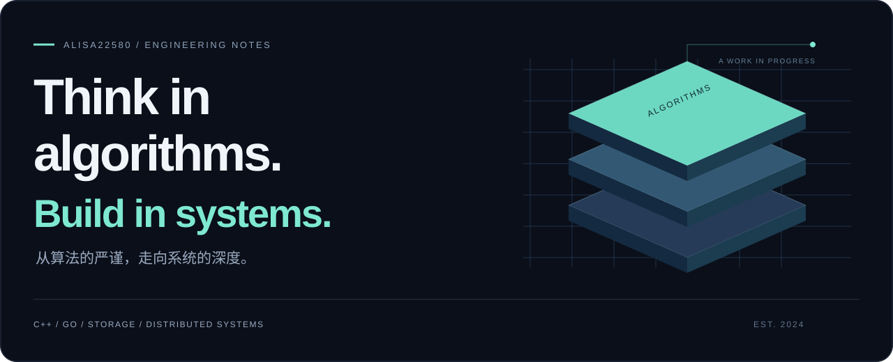
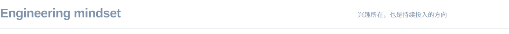

<p align="center">
  
</p>

<p align="center">
  <a href="https://alisa22580.com/"><b>数字花园 ↗</b></a> &nbsp;&nbsp; · &nbsp;&nbsp;
  <a href="https://codeforces.com/profile/alisa22580"><b>Codeforces ↗</b></a> &nbsp;&nbsp; · &nbsp;&nbsp;
  <a href="https://github.com/2258009564?tab=repositories"><b>全部仓库 ↗</b></a>
</p>

### 我是 alisa22580，一名软件工程学生。

从 C++ 与算法竞赛出发，向存储系统与分布式基础设施深入。喜欢把问题抽象清楚，再用代码和验证把它落到实处；这里既有长期积累的算法练习，也有系统学习的记录和为自己写的小工具。

<br />


<p>
  <a href="https://github.com/2258009564/raft-study"></a>
  <a href="https://github.com/2258009564/MYWORK"></a>
  <a href="https://github.com/2258009564/SelectEcho"></a>
  <a href="https://github.com/2258009564/cph_for_nvim"></a>
</p>

<sub>项目入口：[Raft 学习文档](https://github.com/2258009564/raft-study) · [算法练习](https://github.com/2258009564/MYWORK) · [SelectEcho](https://github.com/2258009564/SelectEcho) · [Neovim 插件](https://github.com/2258009564/cph_for_nvim)</sub>

<br />
<br />



**算法是起点。** 在建模、证明和复杂度之间训练精确思考，把解题中的严谨带到工程里。

**系统是方向。** 关注数据如何保存、状态如何复制，以及系统在故障发生后如何恢复。围绕 Raft、日志与存储机制持续学习。

**工具是实践。** 从阅读和编码中的真实需求出发，让浏览器扩展、编辑器插件与数字花园成为日常工作的一部分。

<p>
  <code>C++</code> &nbsp; <code>Go</code> &nbsp; <code>Python</code> &nbsp; <code>JavaScript</code> &nbsp; <code>Lua</code>
  <br />
  <sub>Git · Neovim · VS Code · Windows / WSL</sub>
</p>

<br />


<details>
<summary><b>编码时间、语言分布与开发足迹 ↗</b></summary>

<!--START_SECTION:waka-->


**🐱 My GitHub Data** 

> 📦 409.9 kB Used in GitHub's Storage 
 > 
> 🏆 73 Contributions in the Year 2026
 > 
> 💼 Opted to Hire
 > 
> 📜 13 Public Repositories 
 > 
> 🔑 1 Private Repositories 
 > 
**I'm a Night 🦉** 

```text
🌞 Morning                17 commits          █░░░░░░░░░░░░░░░░░░░░░░░░   03.05 % 
🌆 Daytime                126 commits         ██████░░░░░░░░░░░░░░░░░░░   22.58 % 
🌃 Evening                343 commits         ███████████████░░░░░░░░░░   61.47 % 
🌙 Night                  72 commits          ███░░░░░░░░░░░░░░░░░░░░░░   12.90 % 
```
📅 **I'm Most Productive on Monday** 

```text
Monday                   217 commits         ██████████░░░░░░░░░░░░░░░   38.89 % 
Tuesday                  32 commits          █░░░░░░░░░░░░░░░░░░░░░░░░   05.73 % 
Wednesday                72 commits          ███░░░░░░░░░░░░░░░░░░░░░░   12.90 % 
Thursday                 34 commits          ██░░░░░░░░░░░░░░░░░░░░░░░   06.09 % 
Friday                   93 commits          ████░░░░░░░░░░░░░░░░░░░░░   16.67 % 
Saturday                 60 commits          ███░░░░░░░░░░░░░░░░░░░░░░   10.75 % 
Sunday                   50 commits          ██░░░░░░░░░░░░░░░░░░░░░░░   08.96 % 
```


📊 **This Week I Spent My Time On** 

```text
🕑︎ Time Zone: Asia/Shanghai

💬 Programming Languages: 
C++                      5 hrs 22 mins       ████████░░░░░░░░░░░░░░░░░   33.48 % 
Other                    4 hrs 9 mins        ██████░░░░░░░░░░░░░░░░░░░   25.88 % 
Markdown                 3 hrs 48 mins       ██████░░░░░░░░░░░░░░░░░░░   23.74 % 
HTML                     46 mins             █░░░░░░░░░░░░░░░░░░░░░░░░   04.84 % 
JSON                     28 mins             █░░░░░░░░░░░░░░░░░░░░░░░░   02.94 % 

🔥 Editors: 
Codex Vscode             8 hrs 22 mins       █████████████░░░░░░░░░░░░   52.22 % 
VS Code                  7 hrs 32 mins       ████████████░░░░░░░░░░░░░   46.94 % 
Obsidian                 7 mins              ░░░░░░░░░░░░░░░░░░░░░░░░░   00.77 % 
Codex CLI                0 secs              ░░░░░░░░░░░░░░░░░░░░░░░░░   00.07 % 

🐱‍💻 Projects: 
new-chat                 4 hrs 25 mins       ███████░░░░░░░░░░░░░░░░░░   27.54 % 
MIT-6.5840               3 hrs 41 mins       ██████░░░░░░░░░░░░░░░░░░░   22.96 % 
MYWORK                   3 hrs 19 mins       █████░░░░░░░░░░░░░░░░░░░░   20.69 % 
mizuki                   1 hr 4 mins         ██░░░░░░░░░░░░░░░░░░░░░░░   06.71 % 
https-www-bilibili-com-vi51 mins             █░░░░░░░░░░░░░░░░░░░░░░░░   05.32 % 

💻 Operating System: 
Windows                  16 hrs 3 mins       █████████████████████████   100.00 % 
```

🤖 **AI Coding This Week** 

```text
⏱ AI Coding Time: 9 hrs 9 mins (57.01%)

✍️ 1,406 lines written by AI, 1,616 lines written by hand (46.53% AI-written)

🔤 6,773,965 Input Tokens, 385,169 Output Tokens

💵 $44.08 Estimated AI Cost This Week

🧠 34 AI Sessions, 166 AI Prompts

GPT                      1,435 lines         █████████████████████████   100.00 % 
Codex-Vscode             0 lines             ░░░░░░░░░░░░░░░░░░░░░░░░░   00.00 % 

🔎 AI Coding Insights:
⚖️ Balanced with AI — 46.53% of written lines came from AI
📚 Verbose Prompter — average 3,203 characters per prompt
🔁 Iterative Prompter — average 5 prompts per session
🔍 Hands-On Reviewer — 62.53% of changed lines were hand-edited
```

**I Mostly Code in JavaScript** 

```text
JavaScript               3 repos             ███████░░░░░░░░░░░░░░░░░░   27.27 % 
C++                      2 repos             █████░░░░░░░░░░░░░░░░░░░░   18.18 % 
Lua                      1 repo              ██░░░░░░░░░░░░░░░░░░░░░░░   09.09 % 
Vue                      1 repo              ██░░░░░░░░░░░░░░░░░░░░░░░   09.09 % 
CSS                      1 repo              ██░░░░░░░░░░░░░░░░░░░░░░░   09.09 % 
```


**Timeline**


 Last Updated on 02/10/2026 22:24:30 UTC
<!--END_SECTION:waka-->

</details>

<br />


<p align="center">
  <sub><a href="https://github.com/2258009564">@2258009564</a> &nbsp; / &nbsp; <a href="https://alisa22580.com/">alisa22580.com</a></sub>
</p>
