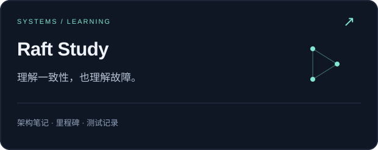
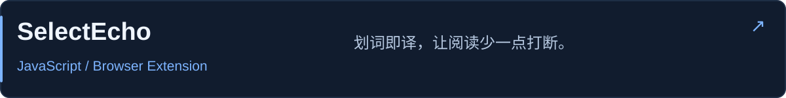
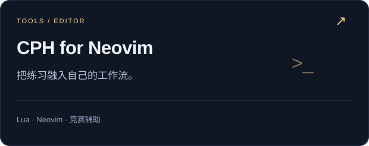
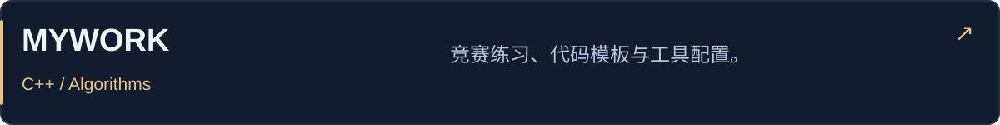
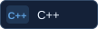

<picture><source media="(max-width: 600px)" srcset="./assets/banner-mobile.svg" /></picture>

<p align="center"><picture><source media="(max-width: 600px)" srcset="./assets/status-mobile.svg" /></picture></p>

<p align="center">
  <a href="https://alisa22580.com/"><b>数字花园</b></a> &nbsp; · &nbsp;
  <a href="https://codeforces.com/profile/alisa22580"><b>Codeforces</b></a> &nbsp; · &nbsp;
  <a href="https://github.com/2258009564?tab=repositories"><b>项目仓库</b></a>
</p>

### 👋 About

我是 **alisa22580**，软件工程学生、ACMer。以 C++ 和算法竞赛为起点，向存储与分布式基础设施深入；也用 Go、JavaScript 和 Lua 做学习实验、浏览器工具与编辑器插件。

```yaml
base:  C++ / ACM
focus: Systems & Infra
build: Notes & tools
```

### 🏆 ICPC / CCPC

| 年份 | 赛事 | 成绩 |
| :---: | --- | --- |
| 2026 | ICPC 重庆省赛 | 🥇 **金牌 · Rank 12** |
| 2026 | ICPC 广西邀请赛 | 🥈 **银牌** |
| 2026 | ICPC 沈阳邀请赛 | 🥈 **银牌** |
| 2026 | CCPC 东北赛 | 🥉 铜牌 |
| 2025 | CCPC 黑龙江省赛 | 🥈 **银牌** |
| 2025 | CCPC 东北赛 | 🥉 铜牌 |

#### 蓝桥杯

| 年份 | 赛事 | 成绩 |
| :---: | --- | --- |
| 2026 | 第十七届蓝桥杯全国总决赛 | **一等奖** |
| 2026 | 第十七届蓝桥杯黑龙江省赛 · C++ B 组 | **一等奖 · 黑龙江省第 2** |

### 🚀 Selected projects

<a href="https://github.com/2258009564/raft-study"><picture><source media="(max-width: 600px)" srcset="./assets/raft-mobile.svg" /></picture></a>

Raft 的中文架构笔记与阶段验收记录；公开仓库为学习文档。

<a href="https://github.com/2258009564/SelectEcho"><picture><source media="(max-width: 600px)" srcset="./assets/selectecho-mobile.svg" /></picture></a>

面向 Chrome / Edge 的划词翻译扩展，关注引擎策略与结构保真展示。

<a href="https://github.com/2258009564/cph_for_nvim"><picture><source media="(max-width: 600px)" srcset="./assets/neovim-mobile.svg" /></picture></a>

接收 Competitive Companion 题目，在 Neovim 内管理用例、运行程序与比较输出。

<a href="https://github.com/2258009564/MYWORK"><picture><source media="(max-width: 600px)" srcset="./assets/algorithms-mobile.svg" /></picture></a>

算法竞赛练习、C++ 模板与编辑器配置的积累。

### 🛠 Tech stack

**Languages**<br />
    

**Workspace**<br />
  

Windows / WSL · 算法练习 · 系统学习 · 工具开发

### 📊 Coding activity

<details>
<summary><b>展开 WakaTime 编码统计</b></summary>

<!--START_SECTION:waka-->


**🐱 My GitHub Data** 

> 📦 410.0 kB Used in GitHub's Storage 
 > 
> 🏆 88 Contributions in the Year 2026
 > 
> 💼 Opted to Hire
 > 
> 📜 14 Public Repositories 
 > 
> 🔑 2 Private Repositories 
 > 
**I'm a Night 🦉** 

```text
🌞 Morning                17 commits          █░░░░░░░░░░░░░░░░░░░░░░░░   02.98 % 
🌆 Daytime                126 commits         ██████░░░░░░░░░░░░░░░░░░░   22.07 % 
🌃 Evening                343 commits         ███████████████░░░░░░░░░░   60.07 % 
🌙 Night                  85 commits          ████░░░░░░░░░░░░░░░░░░░░░   14.89 % 
```
📅 **I'm Most Productive on Monday** 

```text
Monday                   217 commits         ██████████░░░░░░░░░░░░░░░   38.00 % 
Tuesday                  32 commits          █░░░░░░░░░░░░░░░░░░░░░░░░   05.60 % 
Wednesday                72 commits          ███░░░░░░░░░░░░░░░░░░░░░░   12.61 % 
Thursday                 34 commits          █░░░░░░░░░░░░░░░░░░░░░░░░   05.95 % 
Friday                   93 commits          ████░░░░░░░░░░░░░░░░░░░░░   16.29 % 
Saturday                 60 commits          ███░░░░░░░░░░░░░░░░░░░░░░   10.51 % 
Sunday                   63 commits          ███░░░░░░░░░░░░░░░░░░░░░░   11.03 % 
```


📊 **This Week I Spent My Time On** 

```text
🕑︎ Time Zone: Asia/Shanghai

💬 Programming Languages: 
Other                    5 hrs 47 mins       ███████░░░░░░░░░░░░░░░░░░   29.14 % 
Markdown                 5 hrs 17 mins       ███████░░░░░░░░░░░░░░░░░░   26.63 % 
C++                      3 hrs 53 mins       █████░░░░░░░░░░░░░░░░░░░░   19.59 % 
Python                   1 hr 49 mins        ██░░░░░░░░░░░░░░░░░░░░░░░   09.19 % 
Go                       58 mins             █░░░░░░░░░░░░░░░░░░░░░░░░   04.95 % 

🔥 Editors: 
Codex Vscode             13 hrs 20 mins      █████████████████░░░░░░░░   67.18 % 
VS Code                  6 hrs 19 mins       ████████░░░░░░░░░░░░░░░░░   31.84 % 
Obsidian                 7 mins              ░░░░░░░░░░░░░░░░░░░░░░░░░   00.62 % 
Codex CLI                4 mins              ░░░░░░░░░░░░░░░░░░░░░░░░░   00.36 % 

🐱‍💻 Projects: 
new-chat                 3 hrs 52 mins       █████░░░░░░░░░░░░░░░░░░░░   19.54 % 
牛客Raft面经研究               3 hrs 44 mins       █████░░░░░░░░░░░░░░░░░░░░   18.83 % 
MIT-6.5840               3 hrs 42 mins       █████░░░░░░░░░░░░░░░░░░░░   18.66 % 
MYWORK                   1 hr 55 mins        ██░░░░░░░░░░░░░░░░░░░░░░░   09.68 % 
yaml-multi-raft-infra-mul1 hr 33 mins        ██░░░░░░░░░░░░░░░░░░░░░░░   07.82 % 

💻 Operating System: 
Windows                  19 hrs 50 mins      █████████████████████████   100.00 % 
```

🤖 **AI Coding This Week** 

```text
⏱ AI Coding Time: 14 hrs 30 mins (73.12%)

✍️ 3,572 lines written by AI, 1,392 lines written by hand (71.96% AI-written)

🔤 9,658,818 Input Tokens, 661,873 Output Tokens

💵 $48.73 Estimated AI Cost This Week

🧠 47 AI Sessions, 217 AI Prompts

GPT                      3,603 lines         █████████████████████████   100.00 % 
Codex-Vscode             0 lines             ░░░░░░░░░░░░░░░░░░░░░░░░░   00.00 % 

🔎 AI Coding Insights:
🤖 AI-Driven — 71.96% of written lines came from AI
📚 Verbose Prompter — average 3,114 characters per prompt
🔁 Iterative Prompter — average 5 prompts per session
🚀 High AI Trust — 36.83% of changed lines were hand-edited
```

**I Mostly Code in JavaScript** 

```text
JavaScript               3 repos             ██████░░░░░░░░░░░░░░░░░░░   25.00 % 
Go                       1 repo              ██░░░░░░░░░░░░░░░░░░░░░░░   08.33 % 
Lua                      1 repo              ██░░░░░░░░░░░░░░░░░░░░░░░   08.33 % 
Vue                      1 repo              ██░░░░░░░░░░░░░░░░░░░░░░░   08.33 % 
CSS                      1 repo              ██░░░░░░░░░░░░░░░░░░░░░░░   08.33 % 
```


**Timeline**


 Last Updated on 03/10/2026 21:33:55 UTC
<!--END_SECTION:waka-->

</details>

---

<p align="center">
  <b>把问题想清楚，把系统做扎实。</b><br />
  <sub>Algorithms sharpen the mind. Systems deepen the craft.</sub>
</p>
